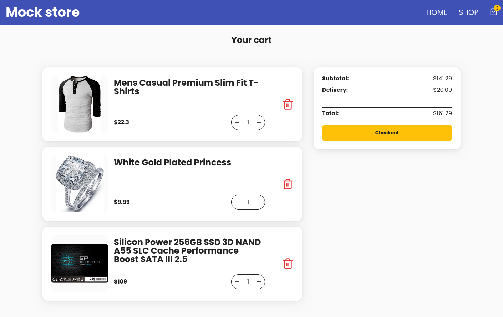

# 🛒 Shopping Cart

A simple shopping cart with mock data built in React as part of [The Odin Project](https://www.theodinproject.com/) curriculum.

Visit the [live demo](https://shooping-cart-fran-dv.netlify.app/)

## 📚 About the Project
This project is an assignment from the React section of The Odin Project curriculum, created to put learned concepts into practice. The use of TypeScript, Zustand, and Zod are personal additions. In particular, I chose to include Zustand to gain experience managing global state in a modern way.

[See the original assignment](https://www.theodinproject.com/lessons/node-path-react-new-shopping-cart)

## ✨ Features
- Browse mock products
- Product fetching from [Fake Store API](https://fakestoreapi.com/)
- API response to local model data validation with Zod
- Client-side routing with React Router DOM
- Add, remove, and update items in the cart
- Responsive and clean UI
- Global state management with [Zustand](https://zustand-demo.pmnd.rs/)
- Snackbar notifications for cart actions

## 🛠️ Tech Stack
- [React](https://react.dev/)
- [React Router DOM](https://reactrouter.com/)
- [Vite](https://vitejs.dev/)
- [TypeScript](https://www.typescriptlang.org/)
- [Zustand](https://zustand-demo.pmnd.rs/) for global state
- [Zod](https://zod.dev/) for API response validation
- [Lucide](https://lucide.dev/) icons library

